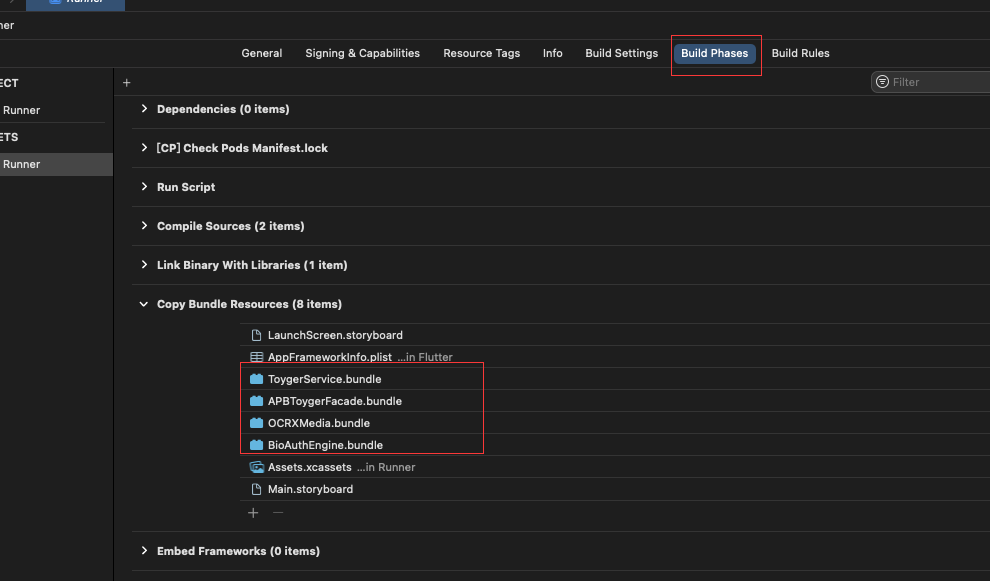

# aliyun_face

阿里云人脸识别

地址： [金融级实人认证方案](https://help.aliyun.com/document_detail/163106.htm?spm=a2c4g.11186623.0.0.4036310fXUfeSk#h2-url-1)


## IOS
需要摄像头权限和网络权限


[获取文件](./ios/Assets)
将bundle文件拖入图片里的地方



## Android
需要摄像头权限和网络权限

[获取文件](./android/libs)
在 项目/android/app 里创建libs导入文件

在 项目/android/app/build.gradle中添加
```

dependencies {
    implementation "org.jetbrains.kotlin:kotlin-stdlib-jdk7:$kotlin_version"

+   implementation fileTree(include: ['*.jar', '*.aar'], dir: 'libs')
}
```

## AliyunFace
```
    /// 进入应用时调用
    await AliyunFace.init();

    /// 获取metaInfo 传递给后端拿取mID
    String metaInfo = await AliyunFace.getMetaInfos;

    /// 开始人脸识别
    bool status = await AliyunFace.verify('后端返回的ID');
```